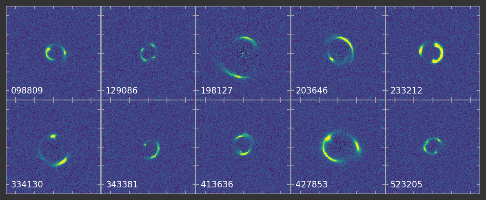

# Substructure detection challenge

_Examples rendered with HST resolution, PSF, and noise. Ticks are 2 arcsec_

* 10 systems with substructure drawn from different mass functions.
* Files contain the lensed source emission only, no PSF and no noise, units are W m^-2 arcsec^-2
* Pixel scale is 0.01 arcsec

Lens and source redshifts below

| Catalogue # | Z_Lens | Z_Source |
| --- | --- | --- |
| 98809       | 1.034 | 3.013 |
| 129086      | 0.630 | 3.561 |
| 198127      | 0.568 | 2.435 |
| 203646      | 0.564 | 2.225 |
| 233212      | 1.165 | 2.629 |
| 334130      | 0.665 | 2.534 |
| 343381      | 1.563 | 3.231 |
| 413636      | 0.883 | 2.962 |
| 427853      | 0.835 | 1.972 |
| 523205      | 1.181 | 3.337 |
